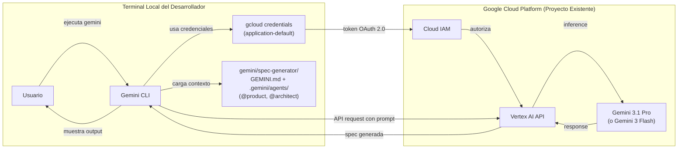

# AI Spec Discovery Fase 1 - Infrastructure Architecture Proposal

**Date**: 2026-03-19
**Author**: Architecture Team
**Status**: Draft

---

## 1. Infrastructure Requirements Summary

### Contexto de la Fase 1

Esta fase NO requiere infraestructura nueva ni cambios en Kubernetes/ArgoCD. El plugin de Gemini CLI opera completamente en la terminal local del desarrollador. La unica dependencia de infraestructura es la autenticacion contra Vertex AI en un proyecto GCP existente.

### Services Required

- Ninguno. El plugin es un conjunto de archivos .md (GEMINI.md + subagents en .gemini/agents/) que Gemini CLI carga localmente desde gemini/spec-generator/. No hay servicios que desplegar.

### Data Stores Required

- Ninguno. Las specs generadas se almacenan manualmente en el repositorio del proyecto (git).

### Creditos GCP Disponibles

El equipo cuenta con **creditos activos en la consola de GCP** que cubren el consumo de Vertex AI para esta fase. El costo estimado de generacion de specs es negligible (< $2/mes), por lo que los creditos disponibles son mas que suficientes para el periodo de evaluacion de Fase 1.

### External Integrations

| Servicio | Proposito | Estado |
|----------|----------|--------|
| **Vertex AI API** | Ejecutar modelos Gemini (3.1 Pro, 3 Flash) via Gemini CLI | Requiere habilitacion en proyecto GCP existente. Cubierto por creditos GCP disponibles |
| **Google Cloud IAM** | Autenticacion del usuario via ADC o Service Account | Proyecto GCP existente |

### Non-Functional Requirements

- Disponibilidad: N/A (herramienta local, no hay SLA)
- Escalabilidad: N/A (ejecucion individual por usuario)
- Seguridad: Credenciales de GCP gestionadas via `gcloud` CLI (no se almacenan tokens en el repositorio)
- Latencia: Generacion de spec completa en menos de 30 segundos (definido en acceptance_criteria)

---

## 2. Orchestration Architecture

### No aplica para Fase 1

Esta fase no utiliza Kubernetes ni ArgoCD. No hay servicios que orquestar. El plugin opera completamente en la terminal local.

En fases futuras (Fase 2+), si se construye un servicio centralizado de generacion de specs, se evaluara la orquestacion via K8s + ArgoCD siguiendo el modelo estandar del equipo.

---

## 3. GCP Configuration (Unico proveedor relevante)

### Vertex AI Setup

Dado que Gemini CLI se autentica contra Vertex AI, la unica configuracion necesaria es habilitar la API y configurar credenciales en el proyecto GCP existente.

#### Metodos de autenticacion

Gemini CLI con Vertex AI soporta dos metodos de autenticacion. **Vertex AI NO soporta API keys** (solo funcionan con Google AI Studio, que es un endpoint diferente).

| Metodo | Comando | Recomendado para |
|--------|---------|-----------------|
| **ADC (Application Default Credentials)** | `gcloud auth application-default login` | Desarrollo local (recomendado) |
| **Service Account JSON** | `export GOOGLE_APPLICATION_CREDENTIALS=/path/to/key.json` | Entornos sin gcloud o CI/CD |

#### Pasos de configuracion (Metodo ADC - Recomendado)

```
1. Habilitar Vertex AI API en el proyecto GCP (con creditos disponibles)
   $ gcloud services enable aiplatform.googleapis.com --project={PROJECT_ID}

2. Configurar credenciales de aplicacion por defecto (genera token OAuth 2.0)
   $ gcloud auth application-default login

3. Configurar variables de entorno para Gemini CLI
   $ export GOOGLE_CLOUD_PROJECT={PROJECT_ID}
   $ export GOOGLE_CLOUD_LOCATION=us-central1

4. Verificar acceso
   $ gemini  (debe iniciar sin errores de autenticacion)
```

#### Pasos de configuracion (Metodo Service Account - Alternativa)

```
1. Habilitar Vertex AI API en el proyecto GCP
   $ gcloud services enable aiplatform.googleapis.com --project={PROJECT_ID}

2. Crear Service Account desde la consola de GCP
   - Ir a IAM & Admin > Service Accounts
   - Crear cuenta: spec-discovery-sa@{PROJECT_ID}.iam.gserviceaccount.com
   - Asignar rol: Vertex AI User (roles/aiplatform.user)
   - Generar y descargar JSON key

3. Configurar variables de entorno
   $ export GOOGLE_APPLICATION_CREDENTIALS=/path/to/spec-discovery-sa-key.json
   $ export GOOGLE_CLOUD_PROJECT={PROJECT_ID}
   $ export GOOGLE_CLOUD_LOCATION=us-central1

4. Verificar acceso
   $ gemini  (debe iniciar sin errores de autenticacion)
```

**IMPORTANTE**: No commitear el archivo JSON key al repositorio. Agregarlo a .gitignore.

#### Permisos IAM requeridos

| Rol | Proposito | Scope |
|-----|----------|-------|
| `roles/aiplatform.user` | Permite enviar requests a modelos de Vertex AI | Proyecto GCP |

Para asignar el rol a un usuario o service account:

```
# Para usuario (metodo ADC)
gcloud projects add-iam-policy-binding {PROJECT_ID} \
  --member="user:{EMAIL}" \
  --role="roles/aiplatform.user"

# Para service account
gcloud projects add-iam-policy-binding {PROJECT_ID} \
  --member="serviceAccount:spec-discovery-sa@{PROJECT_ID}.iam.gserviceaccount.com" \
  --role="roles/aiplatform.user"
```

### Diagram: Autenticacion Gemini CLI -> Vertex AI



### Modelos disponibles y configuracion

| Modelo | Caso de uso | Configuracion en Gemini CLI |
|--------|------------|----------------------------|
| **Gemini 3.1 Pro** (default) | Generacion de specs complejas, features con multiples criterios y reglas de negocio | `gemini` (sin flags adicionales) |
| **Gemini 3 Flash** | Iteraciones rapidas, features simples, refinamiento de specs existentes | `gemini --model gemini-3-flash` (verificar flag exacto en documentacion de Gemini CLI) |

### Estimated Monthly Cost

| Concepto | Detalle | Costo estimado |
|----------|---------|----------------|
| Vertex AI - Gemini 3.1 Pro (input) | ~5K tokens input promedio por spec (contexto GEMINI.md + convenciones + input usuario) | ~$0.01 por spec |
| Vertex AI - Gemini 3.1 Pro (output) | ~2K tokens output promedio por spec generada | ~$0.005 por spec |
| Vertex AI - volumen estimado | ~50-100 specs/mes (equipo de 5-10 personas) | **$0.75 - $1.50 / mes** |
| gcloud CLI | Incluido en el proyecto GCP existente | $0 |
| Almacenamiento | Archivos .md en repositorio git | $0 |
| **Total estimado** | | **< $2 / mes** |

El costo es negligible. Vertex AI cobra por tokens procesados, y el volumen esperado para generacion de specs es minimo comparado con otros workloads del proyecto.

---

## 4. AWS Proposal

### No aplica para Fase 1

El equipo utiliza GCP como proveedor cloud y Gemini CLI se autentica exclusivamente contra Vertex AI. No hay equivalente directo en AWS para esta fase.

En fases futuras, si se construye un servicio centralizado, se evaluara AWS Bedrock con modelos Claude como alternativa. Pero para Fase 1, la infraestructura es exclusivamente GCP.

---

## 5. AWS vs GCP Comparison

### No aplica para Fase 1

Dado que esta fase depende exclusivamente de Gemini CLI + Vertex AI (herramienta de Google), no hay comparacion AWS vs GCP relevante. La eleccion de GCP no es una decision arquitectonica de esta fase sino un pre-requisito del producto (Gemini CLI solo funciona con Vertex AI o API key de Google AI Studio).

En fases futuras, cuando se evalue un servicio centralizado, la comparacion AWS (Bedrock) vs GCP (Vertex AI) sera relevante y se documentara en el infrastructure-proposal correspondiente.

---

## 6. Recommendation

**Proveedor seleccionado**: GCP (unica opcion viable para Gemini CLI)

**Justification**:
- Gemini CLI requiere Vertex AI como backend, lo cual hace de GCP la unica opcion
- El proyecto GCP ya existe y el equipo ya tiene credenciales configuradas
- El costo adicional es negligible (< $2/mes)
- No se requiere infraestructura nueva (no K8s, no bases de datos, no servicios desplegados)

**Acciones requeridas**:
1. Verificar que la API de Vertex AI esta habilitada en el proyecto GCP del equipo
2. Verificar que los miembros del equipo tienen el rol `roles/aiplatform.user`
3. Documentar los pasos de configuracion en el README del plugin

**Trade-offs aceptados**:
- Dependencia exclusiva de Google para la fase de Discovery (mitigado por el hecho de que la fase de Delivery sigue usando Claude Code, manteniendo diversidad de proveedores)
- Costo no controlado por tokens (mitigado por el volumen extremadamente bajo esperado)

---

**End of Infrastructure Proposal**
