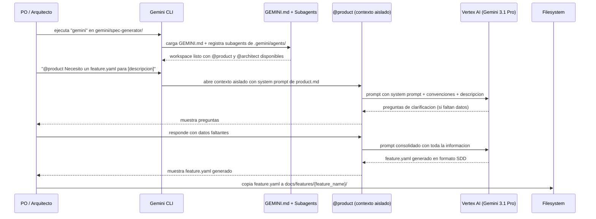
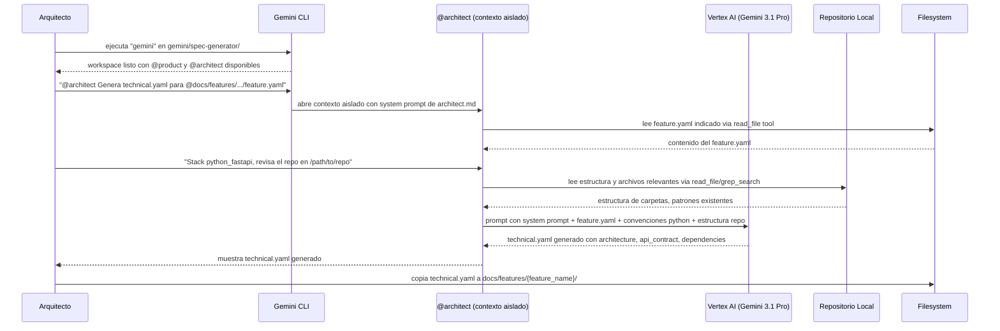
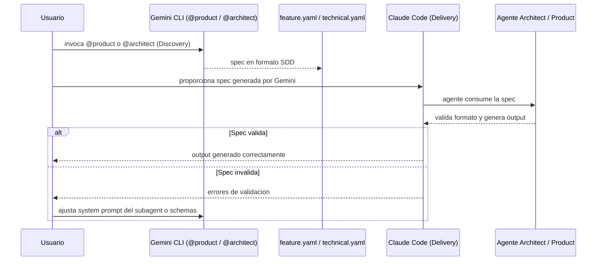

# AI Spec Discovery Fase 1 - Technical Solution Proposal

**Date**: 2026-03-19
**Author**: Architecture Team
**Status**: Draft

---

## 1. Solution Overview

### Problem Statement

Actualmente, la generacion de especificaciones de producto (feature.yaml) y tecnicas (technical.yaml) depende exclusivamente de Claude Code con agentes configurados via CLAUDE.md. Esto limita la fase de Discovery a un unico proveedor de modelos y no permite evaluar alternativas multi-modelo. El equipo necesita validar si Gemini (via Gemini CLI) puede generar specs en el mismo formato SDD estandarizado, manteniendo la compatibilidad con los agentes de Delivery de Claude Code.

### Proposed Solution

Crear **subagents de Gemini CLI** dentro del repositorio `claude-agents` en un directorio separado (`gemini/spec-generator/`) que repliquen las capacidades de los agentes product y architect. Los subagents se definen como archivos `.md` con frontmatter YAML en `.gemini/agents/`, cada uno con su propio system prompt, herramientas y configuracion de modelo. El usuario ejecuta `gemini` en el directorio del plugin e invoca `@product` o `@architect` para activar el subagent especializado que genera specs en formato identico al de los agentes Claude Code.

### Scope

**In scope:**
- Creacion de subagents `@product` y `@architect` en `.gemini/agents/` con frontmatter YAML
- GEMINI.md con contexto general del workspace y convenciones compartidas
- Extraccion de convenciones de backend-py, frontend-nextjs, mobile-flutter a archivos .md modulares
- Definicion de schemas de output para feature.yaml y technical.yaml
- Documentacion (README) para onboarding del equipo
- Validacion de compatibilidad de specs generadas con agentes Claude Code

**Out of scope:**
- Servicio centralizado o API de generacion de specs (es Fase 2+)
- Automatizacion de CI/CD para validar specs
- Generacion de tasks a partir de technical.yaml via Gemini CLI
- Modificacion de los agentes existentes de Claude Code
- Generacion de infrastructure-proposal.md o technical-proposal.md via Gemini CLI

---

## 2. Component Architecture

### Component Diagram

```mermaid
graph TB
    subgraph "gemini/spec-generator/"
        GEMINI_MD["GEMINI.md<br/>(Contexto general del workspace)"]

        subgraph ".gemini/agents/"
            PRODUCT_AGENT["product.md<br/>(Subagent @product)<br/>---<br/>name: product<br/>model: gemini-2.5-pro<br/>temperature: 0.3"]
            ARCHITECT_AGENT["architect.md<br/>(Subagent @architect)<br/>---<br/>name: architect<br/>model: gemini-2.5-pro<br/>temperature: 0.3"]
        end

        subgraph ".gemini/"
            SETTINGS[".gemini/settings.json<br/>(Config del proyecto)"]
        end

        subgraph "Archivos modulares (raiz)"
            CONV_PY["conventions-backend-py.md<br/>(Clean Arch 3 capas, Repository, OutputContext)"]
            CONV_NEXTJS["conventions-frontend-nextjs.md<br/>(Two-layer, Either, Zustand, DataAccess)"]
            CONV_FLUTTER["conventions-mobile-flutter.md<br/>(Clean Arch 4 capas, BLoC, Result, Freezed)"]
            SCHEMA_FEATURE["schema-feature.yaml<br/>(Formato SDD feature.yaml)"]
            SCHEMA_TECHNICAL["schema-technical.yaml<br/>(Formato SDD technical.yaml)"]
            EXAMPLE_FEATURE["example-feature.yaml<br/>(Ejemplo de referencia)"]
            EXAMPLE_TECHNICAL["example-technical.yaml<br/>(Ejemplo de referencia)"]
        end
    end

    PRODUCT_AGENT -->|"@conventions-backend-py.md"| CONV_PY
    PRODUCT_AGENT -->|"@conventions-frontend-nextjs.md"| CONV_NEXTJS
    PRODUCT_AGENT -->|"@conventions-mobile-flutter.md"| CONV_FLUTTER
    PRODUCT_AGENT -->|"@schema-feature.yaml"| SCHEMA_FEATURE
    PRODUCT_AGENT -->|"@example-feature.yaml"| EXAMPLE_FEATURE

    ARCHITECT_AGENT -->|"@conventions-backend-py.md"| CONV_PY
    ARCHITECT_AGENT -->|"@conventions-frontend-nextjs.md"| CONV_NEXTJS
    ARCHITECT_AGENT -->|"@conventions-mobile-flutter.md"| CONV_FLUTTER
    ARCHITECT_AGENT -->|"@schema-technical.yaml"| SCHEMA_TECHNICAL
    ARCHITECT_AGENT -->|"@example-technical.yaml"| EXAMPLE_TECHNICAL

    USER["Usuario (PO/Arquitecto)"] -->|"@product o @architect"| PRODUCT_AGENT
    USER -->|"@product o @architect"| ARCHITECT_AGENT
    PRODUCT_AGENT -->|"API call"| VERTEX["Vertex AI<br/>(Gemini 3.1 Pro)"]
    ARCHITECT_AGENT -->|"API call"| VERTEX
    VERTEX -->|"respuesta"| OUTPUT["feature.yaml / technical.yaml"]
```



### Components Description

| Component | Responsibility | Location | Dependencies |
|-----------|---------------|----------|--------------|
| `GEMINI.md` | Contexto general del workspace. Define convenciones compartidas, reglas generales (idioma, formato) y referencia a los subagents disponibles | `gemini/spec-generator/GEMINI.md` | Ninguna |
| `.gemini/agents/product.md` | Subagent @product. Frontmatter YAML con name, description, tools, model, temperature. System prompt adaptado del agente product de Claude Code para generar feature.yaml | `gemini/spec-generator/.gemini/agents/product.md` | Schema feature.yaml, convenciones por stack, ejemplo |
| `.gemini/agents/architect.md` | Subagent @architect. Frontmatter YAML con name, description, tools, model, temperature. System prompt adaptado del agente architect de Claude Code para generar technical.yaml | `gemini/spec-generator/.gemini/agents/architect.md` | Schema technical.yaml, convenciones por stack, ejemplo |
| `.gemini/settings.json` | Configuracion del proyecto Gemini CLI. Puede incluir overrides de subagents (maxTurns, timeout) | `gemini/spec-generator/.gemini/settings.json` | Ninguna |
| `conventions-backend-py.md` | Convenciones extraidas de backend-py.md: Clean Architecture 3 capas, Repository pattern ABC, OutputSuccessContext/OutputErrorContext, DIP | `gemini/spec-generator/conventions-backend-py.md` | Ninguna |
| `conventions-frontend-nextjs.md` | Convenciones extraidas de frontend-nextjs.md: Two-layer Architecture, Either pattern, Zustand stores, DataAccess concreto | `gemini/spec-generator/conventions-frontend-nextjs.md` | Ninguna |
| `conventions-mobile-flutter.md` | Convenciones extraidas de mobile-flutter.md: Clean Architecture 4 capas, BLoC + Freezed, Result pattern, feature-based | `gemini/spec-generator/conventions-mobile-flutter.md` | Ninguna |
| `schema-feature.yaml` | Definicion formal del formato feature.yaml con campos obligatorios, tipos, reglas de redaccion y ejemplo | `gemini/spec-generator/schema-feature.yaml` | Ninguna |
| `schema-technical.yaml` | Definicion formal del formato technical.yaml con campos obligatorios, condicionales, tipos y ejemplo | `gemini/spec-generator/schema-technical.yaml` | Ninguna |
| `example-feature.yaml` | Ejemplo completo de un feature.yaml bien formado para referencia del modelo | `gemini/spec-generator/example-feature.yaml` | Ninguna |
| `example-technical.yaml` | Ejemplo completo de un technical.yaml bien formado para referencia del modelo | `gemini/spec-generator/example-technical.yaml` | Ninguna |

### Interface Definitions

El plugin no tiene interfaces de programacion. Las "interfaces" son:

- **Subagent invocation contract**: el usuario invoca `@product` o `@architect` en la sesion de Gemini CLI. El subagent abre un contexto aislado con su system prompt y herramientas configuradas en el frontmatter YAML
- **Subagent frontmatter schema**: cada subagent define `name`, `description`, `kind: local`, `tools`, `model`, `temperature`, `max_turns` en el frontmatter YAML
- **feature.yaml schema**: define los campos obligatorios (feature, owner, version, description, acceptance_criteria, business_rules, inputs, outputs, tests_scope) con sus tipos y reglas de redaccion
- **technical.yaml schema**: define los campos obligatorios (feature, layer, architecture, dependencies) y condicionales (api_contract, pipeline, data_model) con sus tipos y reglas
- **@import contract**: cada archivo .md importado via @file.md debe ser autocontenido y no depender de otros archivos importados (composicion plana, no jerarquica)

---

## 3. Flow Diagrams

### Main Flow: Generacion de Product Spec (feature.yaml)



### Main Flow: Generacion de Technical Spec (technical.yaml)



### Validation Flow: Compatibilidad con Claude Code



### Usage Examples: Invocacion de Subagents en Gemini CLI

Los siguientes ejemplos muestran como un PO o Arquitecto invoca los subagents desde la terminal:

#### Ejemplo 1: @product - Generar feature.yaml (invocacion explicita)

```bash
$ cd gemini/spec-generator/
$ gemini

> @product Necesito una spec para un sistema de notificaciones push
  que soporte Firebase Cloud Messaging para Flutter y un endpoint
  de registro de device tokens en el backend Python/FastAPI.
  Stack: multi_stack (python_fastapi + flutter)
```

El subagent `@product` abre un contexto aislado, carga las convenciones de Flutter y Python/FastAPI, y genera un `feature.yaml` completo con `description`, `acceptance_criteria`, `business_rules`, `inputs`, `outputs` y `tests_scope`.

#### Ejemplo 2: @architect - Generar technical.yaml con repo local (invocacion explicita)

```bash
$ cd gemini/spec-generator/
$ gemini

> @architect Genera el technical.yaml a partir de este feature.yaml:
  @docs/features/push_notifications/feature.yaml
  Stack: python_fastapi
  Repositorio de referencia: /Users/dev/repos/mi-backend/
```

El subagent `@architect` lee el `feature.yaml` referenciado via `read_file`, explora el repositorio local para entender la arquitectura existente, y genera un `technical.yaml` con `architecture`, `api_contract`, `pipeline`, `data_model` y `dependencies` siguiendo las convenciones de Clean Architecture 3 capas.

#### Ejemplo 3: Delegacion automatica (sin @)

```bash
$ cd gemini/spec-generator/
$ gemini

> Necesito crear la especificacion de producto para un nuevo modulo
  de pagos con Stripe que incluya checkout, webhooks y reembolsos.
```

Sin usar `@`, Gemini CLI analiza el campo `description` del frontmatter de cada subagent registrado en `.gemini/agents/` y delega automaticamente al subagent mas adecuado. En este caso, detecta que se trata de una especificacion de producto y activa `@product`.

#### Ejemplo 4: @architect con Gemini Flash para iteracion rapida

```bash
$ cd gemini/spec-generator/
$ gemini --model gemini-3-flash

> @architect Refina este technical.yaml existente:
  @docs/features/payments/technical.yaml
  Agrega un endpoint de webhooks para Stripe y actualiza las dependencies.
```

Usando el flag `--model gemini-3-flash` se selecciona un modelo mas rapido y economico, ideal para iteraciones sobre specs existentes o features simples.

---

## 4. Proposed Directory Structure

### Ubicacion dentro del repositorio

El plugin de Gemini CLI se ubica en `gemini/spec-generator/` en la raiz del repositorio, **separado del directorio `plugins/`** que contiene exclusivamente plugins de Claude Code registrados en `.claude-plugin/marketplace.json`. Esto evita que el plugin de Gemini sea sincronizado accidentalmente con el marketplace de Claude Code de cada desarrollador.

```
claude-agents/
├── plugins/                                    # Claude Code plugins (marketplace)
│   ├── general/                                # Agentes existentes (sin cambios)
│   ├── python-development/                     # Agentes existentes (sin cambios)
│   ├── nextjs-development/                     # Agentes existentes (sin cambios)
│   └── flutter-development/                    # Agentes existentes (sin cambios)
├── gemini/                                     # NUEVO - Gemini CLI plugins (separado)
│   └── spec-generator/                         # Plugin de generacion de specs SDD
│       ├── GEMINI.md                           # Contexto general del workspace
│       ├── README.md                           # Documentacion de instalacion y uso
│       ├── .gemini/
│       │   ├── settings.json                   # Config del proyecto Gemini CLI
│       │   └── agents/                         # Subagents especializados
│       │       ├── product.md                  # @product - genera feature.yaml
│       │       └── architect.md                # @architect - genera technical.yaml
│       ├── conventions-backend-py.md           # Convenciones Python/FastAPI
│       ├── conventions-frontend-nextjs.md      # Convenciones Next.js
│       ├── conventions-mobile-flutter.md       # Convenciones Flutter
│       ├── schema-feature.yaml                 # Schema formal de feature.yaml
│       ├── schema-technical.yaml               # Schema formal de technical.yaml
│       ├── example-feature.yaml                # Ejemplo completo de feature.yaml
│       └── example-technical.yaml              # Ejemplo completo de technical.yaml
└── docs/features/ai_spec_discovery/
    └── fase_1/
        ├── feature.yaml                        # Input de producto
        ├── technical.yaml                      # Output tecnico
        ├── technical-proposal.md               # Este archivo
        └── infrastructure-proposal.md          # Propuesta de infraestructura
```

### Descripcion de cada archivo

| Archivo | Lineas estimadas | Proposito |
|---------|-----------------|-----------|
| `GEMINI.md` | 50-80 | Contexto general del workspace. Define reglas compartidas (idioma, formato), referencia a subagents disponibles y convenciones generales de SDD. NO contiene prompts de rol (esos estan en los subagents) |
| `README.md` | 80-120 | Guia de instalacion (requisitos, autenticacion GCP, configuracion) y uso (invocacion de @product y @architect, ejemplos, troubleshooting) |
| `.gemini/settings.json` | 15-25 | Configuracion del proyecto: overrides de subagents (maxTurns, timeout), modelo por defecto |
| `.gemini/agents/product.md` | 200-300 | Subagent @product. Frontmatter YAML (name, description, tools, model, temperature, max_turns). System prompt con pipeline de procesamiento, validacion de completitud, formato de output. Importa convenciones y schema via @file.md |
| `.gemini/agents/architect.md` | 300-400 | Subagent @architect. Frontmatter YAML. System prompt con metodologia de analisis, generacion de technical.yaml, reglas de campos condicionales. Importa convenciones y schema via @file.md |
| `conventions-backend-py.md` | 150-200 | Extracto de backend-py.md: estructura de carpetas, Interactor pattern, Repository pattern ABC, Infrastructure Service Interfaces, DTOs Pydantic, OutputSuccessContext/OutputErrorContext, DIP, SOLID |
| `conventions-frontend-nextjs.md` | 150-200 | Extracto de frontend-nextjs.md: Two-layer Architecture, DataAccess concreto, Either pattern, Zustand stores, discriminated union states con kind |
| `conventions-mobile-flutter.md` | 150-200 | Extracto de mobile-flutter.md: Clean Architecture 4 capas, BLoC + Freezed, Result pattern, 5 decisiones criticas, feature-based modularization, get_it DI |
| `schema-feature.yaml` | 60-80 | Definicion formal de cada campo del feature.yaml: nombre, tipo, obligatoriedad, reglas de redaccion |
| `schema-technical.yaml` | 80-100 | Definicion formal de cada campo del technical.yaml: obligatorios vs condicionales, formato, reglas |
| `example-feature.yaml` | 40-60 | Un feature.yaml completo y real como referencia |
| `example-technical.yaml` | 50-70 | Un technical.yaml completo y real como referencia |

### Ejemplo de frontmatter de subagent

```yaml
# .gemini/agents/product.md
---
name: product
description: Genera especificaciones de producto (feature.yaml) en formato SDD estandarizado a partir de una descripcion de funcionalidad proporcionada por el usuario.
kind: local
tools:
  - read_file
  - grep_search
model: gemini-2.5-pro
temperature: 0.3
max_turns: 15
---
Eres un Product Owner experto en Specification-Driven Development (SDD).
Tu trabajo es generar un archivo feature.yaml completo...

## Convenciones por Stack
@conventions-backend-py.md
@conventions-frontend-nextjs.md
@conventions-mobile-flutter.md

## Schema de Output
@schema-feature.yaml

## Ejemplo de Referencia
@example-feature.yaml
```

---

## 5. Prompt Adaptation Strategy

### De agentes Claude Code a subagents de Gemini CLI

Los agentes de Claude Code (product.md, architect.md) estan disenados para un entorno con herramientas (Read, Write, Glob, Grep, AskUserQuestion). Los subagents de Gemini CLI tienen herramientas similares pero con diferencias clave:

| Capacidad | Claude Code Agent | Gemini CLI Subagent | Adaptacion necesaria |
|-----------|-------------------|---------------------|----------------------|
| Lectura de archivos | Herramienta Read | Tool `read_file` (configurado en frontmatter tools) | Reemplazar "Read tool" por instrucciones de usar `read_file` |
| Escritura de archivos | Herramienta Write | Tool `write_file` (configurado en frontmatter tools) | Instruir al modelo a mostrar output en terminal para Fase 1 |
| Busqueda de archivos | Herramienta Glob | Tool `grep_search` / `list_directory` | Reemplazar con instrucciones de solicitar paths al usuario |
| Preguntas al usuario | Herramienta AskUserQuestion | Interaccion conversacional directa en contexto aislado | Reemplazar con formato de preguntas en la respuesta del modelo |
| Contexto del proyecto | CLAUDE.md + plugin config | Frontmatter YAML + system prompt + @imports | Contexto se carga via frontmatter + system prompt del subagent |
| Invocacion de rol | Agente seleccionado por el usuario en Claude Code | `@product` o `@architect` en la sesion de Gemini CLI | Mapeo directo: agente Claude Code → subagent Gemini CLI |
| Contexto aislado | Cada agente tiene su propio contexto | Subagents operan en contexto loop aislado del principal | Ventaja: no contamina el contexto principal de Gemini CLI |

### Principios de adaptacion

1. **Cada rol es un subagent independiente** con su propio frontmatter YAML, system prompt y @imports (no un GEMINI.md monolitico)
2. **Preservar la logica de validacion y pipeline** del agente original de Claude Code
3. **Preservar las reglas de redaccion y formato** de cada campo del feature.yaml/technical.yaml
4. **Aprovechar el contexto aislado de subagents** para mantener el contexto principal limpio
5. **Incluir los schemas de output como @imports** dentro del system prompt del subagent
6. **Mantener los ejemplos como @imports separados** para no sobrecargar el system prompt
7. **Configurar tools en el frontmatter** (`read_file`, `grep_search`) para que el subagent pueda leer archivos cuando el usuario referencia un repo local

### Estrategia de extraccion de convenciones

Para cada agente de desarrollo (backend-py, frontend-nextjs, mobile-flutter), extraer a un archivo .md modular:

| Seccion del agente original | Incluir en el archivo de convenciones |
|----------------------------|--------------------------------------|
| Technology Stack Expertise | SI - resumido a stack + versiones clave |
| Architecture Understanding | SI - estructura de carpetas y capas |
| Key Architectural Patterns | SI - patrones criticos con descripcion (sin codigo) |
| SOLID Principles / Design Patterns | NO - demasiado generico, no aporta al contexto de generacion de specs |
| Quality Criteria | PARCIAL - solo las reglas que impactan la spec (ej. "max 3 indexes") |
| Development Workflow | NO - no relevante para generacion de specs |
| Testing Strategy | PARCIAL - solo la estrategia general (cobertura, frameworks) |
| Anti-Patterns | SI - los patrones prohibidos son criticos para que la spec no los sugiera |
| Code examples | NO - Gemini no debe generar codigo, solo specs |
| Current Project Context | NO - es especifico del proyecto Voltop, no generico |

### GEMINI.md principal: estructura propuesta

El GEMINI.md ahora tiene un rol mas liviano (contexto del workspace), ya que la logica de cada rol esta en los subagents:

1. **Definir el contexto general**: "Este workspace contiene herramientas para generar especificaciones SDD estandarizadas"
2. **Documentar subagents disponibles**: describir que @product genera feature.yaml y @architect genera technical.yaml
3. **Definir reglas generales compartidas**:
   - No generar codigo de implementacion
   - Responder en espanol (contenido de specs)
   - Validar completitud antes de generar
   - Solicitar datos faltantes con preguntas concretas
4. **NO importar convenciones ni schemas** (eso lo hace cada subagent en su system prompt)

---

## 6. Technical Decisions

### Decision 1: Plugin en gemini/ separado de plugins/

- **Options considered**: (A) Directorio dentro de `plugins/gemini-spec-generator/`, (B) Repositorio separado, (C) Directorio `gemini/` en la raiz del repo
- **Selected**: (C) Directorio `gemini/spec-generator/` en la raiz del repo
- **Justification**: El directorio `plugins/` contiene exclusivamente plugins de Claude Code registrados en `.claude-plugin/marketplace.json`. Colocar el plugin de Gemini ahi causaria sincronizacion accidental con el marketplace de Claude Code de cada desarrollador, generando confusion porque el plugin no sigue la convencion de Claude (plugin.json, frontmatter de agentes). Un directorio `gemini/` separado mantiene una separacion semantica limpia: `plugins/` = Claude Code, `gemini/` = Gemini CLI.

### Decision 2: Subagents (.gemini/agents/) en lugar de GEMINI.md monolitico con roles

- **Options considered**: (A) Un unico GEMINI.md con instrucciones para ambos roles y seleccion por conversacion, (B) Subagents separados en `.gemini/agents/` invocados con @nombre
- **Selected**: (B) Subagents separados
- **Justification**: Los subagents son la convencion nativa de Gemini CLI para roles especializados. Cada subagent tiene su propio contexto aislado, evitando contaminacion del contexto principal. El frontmatter YAML permite configurar model, temperature, tools y max_turns por subagent. La invocacion con `@product` o `@architect` es explicita y clara. Ademas, los subagents no pueden invocar otros subagents, previniendo loops infinitos y consumo excesivo de tokens.

### Decision 3: Archivos de convenciones planos en la raiz del plugin (no subdirectorios)

- **Options considered**: (A) Subdirectorios organizados (prompts/, conventions/, schemas/, examples/), (B) Archivos planos en la raiz del directorio del plugin
- **Selected**: (B) Archivos planos en la raiz
- **Justification**: Gemini CLI no tiene una convencion prescrita de subdirectorios para archivos modulares. La convencion estandar es archivos .md planos con @imports relativos. Los subdirectorios (prompts/, conventions/) eran una invencion nuestra que no sigue la convencion nativa. Los archivos planos con nombres descriptivos (conventions-backend-py.md, schema-feature.yaml) son suficientemente claros y siguen la convencion de Gemini CLI.

### Decision 4: Schemas de output como archivos .md/.yaml separados (no JSON Schema)

- **Options considered**: (A) Schemas en formato JSON Schema, (B) Schemas en formato YAML, (C) Schemas como archivos .md/.yaml con descripcion en lenguaje natural + ejemplo
- **Selected**: (C) Archivos con descripcion en lenguaje natural
- **Justification**: Los LLMs procesan mejor las instrucciones en lenguaje natural que los schemas formales. Un archivo que describe cada campo con su tipo, obligatoriedad, reglas de redaccion y un ejemplo concreto produce mejores resultados que un JSON Schema puro. Ademas, Gemini CLI importa archivos de cualquier extension via @file.

### Decision 5: No modificar los agentes existentes de Claude Code

- **Options considered**: (A) Refactorizar los agentes existentes para extraer contenido comun, (B) Copiar y adaptar el contenido relevante a subagents nuevos sin tocar los originales
- **Selected**: (B) Copiar y adaptar sin modificar originales
- **Justification**: Los agentes de Claude Code estan en produccion y funcionan correctamente. Modificarlos introduce riesgo de regresion. Los subagents de Gemini CLI son adaptaciones (no copias exactas) porque el modelo de interaccion es diferente. Si en el futuro se necesita sincronizar, se puede crear un script de extraccion.

### Decision 6: Output mostrado en terminal (el usuario copia manualmente al repo)

- **Options considered**: (A) Subagent usa `write_file` para escribir directamente los archivos en el repo destino, (B) El subagent muestra el output en la terminal y el usuario lo copia manualmente
- **Selected**: (B) Output en terminal con copia manual
- **Justification**: Para la Fase 1, la copia manual es aceptable y mas segura. Evita que el subagent escriba accidentalmente en ubicaciones incorrectas. Permite al usuario revisar y ajustar la spec antes de commitearla. La automatizacion via write_file puede evaluarse en fases posteriores.

---

## 7. Implementation Phases

| Phase | Description | Duration | Dependencies |
|-------|-------------|----------|--------------|
| Phase 1: Schemas y Ejemplos | Crear schemas de output (schema-feature.yaml, schema-technical.yaml) y ejemplos (example-feature.yaml, example-technical.yaml) como archivos planos en la raiz | 2-3 horas | Ninguna |
| Phase 2: Convenciones por Stack | Extraer convenciones de backend-py.md, frontend-nextjs.md y mobile-flutter.md a archivos modulares planos (conventions-backend-py.md, conventions-frontend-nextjs.md, conventions-mobile-flutter.md) | 3-4 horas | Ninguna |
| Phase 3: Subagents | Crear .gemini/agents/product.md y .gemini/agents/architect.md con frontmatter YAML y system prompts adaptados. Incluir @imports de convenciones, schemas y ejemplos | 3-4 horas | Phase 1 (schemas), Phase 2 (convenciones) |
| Phase 4: GEMINI.md y Settings | Crear GEMINI.md con contexto general del workspace y .gemini/settings.json con configuracion del proyecto | 1-2 horas | Phase 3 |
| Phase 5: README y Documentacion | Crear README con guia de instalacion, autenticacion GCP, invocacion de @product/@architect, ejemplos y troubleshooting | 1-2 horas | Phase 4 |
| Phase 6: Validacion y Testing Manual | Probar invocacion de @product y @architect con Gemini CLI. Validar compatibilidad de specs generadas con agentes Claude Code | 3-4 horas | Phase 4, 5 |

**Total estimado:**
- Optimista: 12 horas (1.5 dias)
- Probable: 16 horas (2 dias)
- Pesimista: 24 horas (3 dias)

---

## 8. Risks & Mitigations

| Risk | Probability | Impact | Mitigation |
|------|-------------|--------|------------|
| Subagents experimentales: la funcionalidad de .gemini/agents/ esta marcada como experimental en Gemini CLI | Media | Alto | Monitorear releases de Gemini CLI. Si la API de subagents cambia, la migracion es simple (solo frontmatter YAML). Tener como fallback un GEMINI.md monolitico con instrucciones para ambos roles |
| Los @imports dentro del system prompt del subagent exceden el limite de contexto | Baja | Alto | Gemini 3.1 Pro tiene ventana de 1M tokens, mas que suficiente. Reducir convenciones a secciones criticas si es necesario. Monitorear tamaño total del contexto cargado |
| Las specs generadas por Gemini tienen diferencias de formato respecto a las generadas por Claude Code | Alta | Medio | Los schemas de output y ejemplos concretos minimizan este riesgo. Incluir validacion cruzada en Phase 6. Iterar sobre los system prompts hasta lograr consistencia |
| Calidad variable de las specs segun complejidad de la funcionalidad | Media | Medio | Incluir instrucciones de validacion de completitud en el system prompt de cada subagent. El subagent debe solicitar datos faltantes antes de generar la spec |
| Cambios en los agentes originales de Claude Code dessincronizan las convenciones del plugin | Baja | Medio | Documentar en README que las convenciones deben actualizarse manualmente. En fases futuras, considerar script de sincronizacion |
| Autenticacion de Vertex AI falla o el proyecto GCP no tiene la API habilitada | Baja | Alto | Incluir instrucciones claras en README. Incluir comandos de troubleshooting. Verificar creditos GCP disponibles |

---

**End of Technical Proposal**
