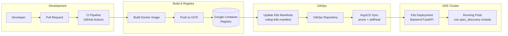
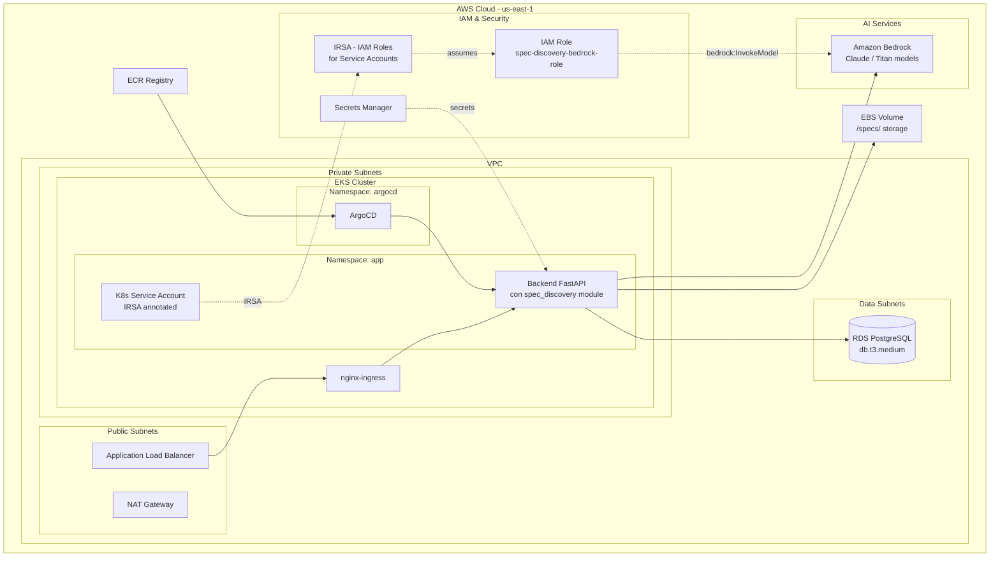

# AI Spec Discovery - Infrastructure Architecture Proposal

**Date**: 2026-03-19
**Author**: Architecture Team
**Status**: Draft

---

## 1. Infrastructure Requirements Summary

### Services Required

- **Backend FastAPI** (existente): El modulo `spec_discovery` se despliega como parte del backend principal. No se requiere un nuevo servicio K8s.
- **Vertex AI API**: Servicio gestionado de GCP para invocar modelos Gemini 3.1 Pro y Gemini 3 Flash.

### Data Stores Required

- **Filesystem (PersistentVolume)**: Almacenamiento de especificaciones en directorio `/specs/` dentro del pod. Se requiere un PersistentVolumeClaim para que los datos sobrevivan reinicios de pods.
- **NO se requiere** base de datos adicional (se reutiliza la existente para auth JWT).

### External Integrations

- **Vertex AI (Gemini 3.1 Pro / Gemini 3 Flash)**: Generacion de especificaciones via API de prediccion.
- **Doppler**: Secretos de aplicacion (configuracion de Vertex AI, project ID, region).

### Non-Functional Requirements

- **Availability**: 99.9% (heredado del backend principal)
- **Scalability**: 20 solicitudes/minuto por usuario, ~100 solicitudes concurrentes en pico
- **Security**: JWT auth, sanitizacion de inputs, Workload Identity para acceso a Vertex AI
- **Latency**: p95 < 10 segundos para generacion de specs

---

## 2. Orchestration Architecture

### Kubernetes & ArgoCD (Infraestructura Existente)

El modulo `spec_discovery` se despliega como parte del backend existente. No se requiere un nuevo servicio K8s, ArgoCD app, ni dominio DNS. Los cambios de infraestructura se limitan a:

1. Habilitar Vertex AI API en el proyecto GCP
2. Crear Service Account con permisos de Vertex AI
3. Configurar Workload Identity Federation
4. Agregar variables de entorno en Doppler
5. Agregar PersistentVolumeClaim para /specs/ (opcional, ver alternativas)

**Cluster Configuration Existente**:
- Region: us-central1
- Zone: us-central1-a
- VPC: privada con subnet-priv-02-grinest
- Ingress: nginx-ingress con cert-manager (Let's Encrypt)
- DNS: ExternalDNS con dominios en voltop.co
- GitOps: ArgoCD con sync automatico (prune + selfHeal)

### GitOps Flow (sin cambios al flujo existente)



### ArgoCD Applications (sin cambios)

El backend ya tiene su ArgoCD Application configurada. El modulo `spec_discovery` se despliega automaticamente al reconstruir la imagen Docker del backend.

| Application | Namespace | Source Repo | Sync Policy |
|-------------|-----------|-------------|-------------|
| Backend API (existente) | app | git@github.com:MiAguila/voltop-k8s-manifest.git | Auto (prune + selfHeal) |

---

## 3. GCP Infrastructure Proposal (Primary - Infraestructura Actual)

### Architecture Diagram

```mermaid
graph TB
    subgraph "GCP Cloud - us-central1"
        subgraph "VPC Network - subnet-priv-02-grinest"
            subgraph "Public"
                GLB[Cloud Load Balancer<br>nginx-ingress]
                CNAT[Cloud NAT]
            end

            subgraph "GKE Cluster - us-central1-a"
                subgraph "Namespace: app"
                    BACKEND[Backend FastAPI<br>con spec_discovery module]
                    BACKEND_SA[K8s Service Account<br>spec-discovery-sa]
                end
                subgraph "Namespace: argocd"
                    ARGOCD[ArgoCD<br>prune + selfHeal]
                end
                INGRESS[nginx-ingress<br>cert-manager]
                PVC[PersistentVolumeClaim<br>/specs/ storage]
            end

            subgraph "Data Layer"
                CSQL[(Cloud SQL PostgreSQL<br>db-custom-2-4096<br>auth/users existente)]
            end
        end

        subgraph "AI Services"
            VERTEX[Vertex AI API<br>Gemini 3.1 Pro<br>Gemini 3 Flash]
        end

        subgraph "IAM & Security"
            GSA[GCP Service Account<br>spec-discovery-vertex-sa]
            WI[Workload Identity<br>Federation]
            GSM[Secret Manager<br>DB passwords]
            DOPPLER[Doppler<br>App secrets]
        end

        GCR[Google Container<br>Registry]
        GITOPS[GitOps Repo<br>voltop-k8s-manifest]
    end

    subgraph "External"
        DNS[ExternalDNS<br>voltop.co]
        CERT[cert-manager<br>Let's Encrypt]
        CODE[Code Repo<br>Backend API]
    end

    DNS --> GLB
    CERT --> INGRESS
    GLB --> INGRESS
    INGRESS --> BACKEND

    BACKEND --> CSQL
    BACKEND --> VERTEX
    BACKEND --> PVC

    BACKEND_SA -.Workload Identity.-> WI
    WI -.binds to.-> GSA
    GSA -.roles/aiplatform.user.-> VERTEX

    DOPPLER -.env vars.-> BACKEND
    GSM -.DB password.-> CSQL

    CODE --> GCR
    GCR --> ARGOCD
    GITOPS --> ARGOCD
    ARGOCD --> BACKEND
```

### New GCP Resources Required

| Resource | Service | Configuration | Purpose |
|----------|---------|---------------|---------|
| Vertex AI API | APIs & Services | Enable `aiplatform.googleapis.com` | Acceso a modelos Gemini |
| Service Account | IAM | `spec-discovery-vertex-sa@{project}.iam.gserviceaccount.com` | Identidad para acceder a Vertex AI |
| IAM Role Binding | IAM | `roles/aiplatform.user` al Service Account | Permisos para invocar modelos de prediccion |
| Workload Identity Binding | IAM | `roles/iam.workloadIdentityUser` - KSA `spec-discovery-sa` en namespace `app` bound a GSA | Autenticacion desde GKE sin key files |
| Vertex AI Quotas | Quotas | Solicitar cuota para Gemini 3.1 Pro y Gemini 3 Flash en us-central1 | Garantizar disponibilidad de modelos |

### Terraform Changes Required (repo gcp-infra)

Los siguientes recursos deben agregarse al repositorio de Terraform `gcp-infra`:

**1. Habilitar Vertex AI API**

```
Resource: google_project_service
API: aiplatform.googleapis.com
```

**2. Service Account para Vertex AI**

```
Resource: google_service_account
Name: spec-discovery-vertex-sa
Display Name: Spec Discovery Vertex AI Service Account
```

**3. IAM Role Binding**

```
Resource: google_project_iam_member
Role: roles/aiplatform.user
Member: serviceAccount:spec-discovery-vertex-sa@{project}.iam.gserviceaccount.com
```

**4. Workload Identity Binding**

```
Resource: google_service_account_iam_member
Role: roles/iam.workloadIdentityUser
Member: serviceAccount:{project}.svc.id.goog[app/spec-discovery-sa]
Service Account: spec-discovery-vertex-sa
```

### K8s Manifest Changes (repo voltop-k8s-manifest)

Siguiendo el patron existente del repositorio `voltop-k8s-manifest`, los cambios necesarios son:

**1. Kubernetes Service Account (en base/)**

```
File: {backend-service}/base/service-account.yaml (nuevo o actualizar existente)
Kind: ServiceAccount
Name: spec-discovery-sa
Namespace: app
Annotations:
  iam.gke.io/gcp-service-account: spec-discovery-vertex-sa@{project}.iam.gserviceaccount.com
```

**2. Deployment update (en base/deployment.yaml)**

Agregar al deployment del backend:
- `serviceAccountName: spec-discovery-sa` (para Workload Identity)
- Volume mount para `/specs/` si se usa PVC
- Variables de entorno para Vertex AI (via Doppler):
  - `VERTEX_AI_PROJECT_ID`
  - `VERTEX_AI_LOCATION` (us-central1)
  - `VERTEX_AI_MODEL_PRO` (gemini-3.1-pro)
  - `VERTEX_AI_MODEL_FLASH` (gemini-3-flash)
  - `SPEC_STORAGE_PATH` (/specs/)

**3. PersistentVolumeClaim (opcional - en base/)**

Si se decide usar almacenamiento persistente para `/specs/`:

```
File: {backend-service}/base/pvc-specs.yaml (nuevo)
Kind: PersistentVolumeClaim
Name: specs-storage-pvc
Storage: 10Gi
AccessModes: ReadWriteOnce
StorageClass: standard (GCE Persistent Disk)
```

**Nota**: Si el volumen de specs es bajo y se acepta perder datos en reinicios, se puede usar `emptyDir` en lugar de PVC. Sin embargo, para produccion se recomienda PVC o migrar a Cloud Storage (GCS) en el futuro.

**4. Overlays (stg y prd)**

Agregar patches en `overlays/stg/` y `overlays/prd/` para:
- Diferentes tamanos de PVC (stg: 5Gi, prd: 10Gi)
- Variables de entorno especificas por ambiente (project ID de stg vs prd)

### Doppler Configuration

Agregar las siguientes variables en Doppler para el backend:

| Variable | Staging Value | Production Value | Description |
|----------|--------------|-----------------|-------------|
| `VERTEX_AI_PROJECT_ID` | `{stg-project-id}` | `{prd-project-id}` | GCP project ID |
| `VERTEX_AI_LOCATION` | `us-central1` | `us-central1` | Region de Vertex AI |
| `VERTEX_AI_MODEL_PRO` | `gemini-3.1-pro` | `gemini-3.1-pro` | Modelo para features complejos |
| `VERTEX_AI_MODEL_FLASH` | `gemini-3-flash` | `gemini-3-flash` | Modelo para features simples |
| `SPEC_STORAGE_PATH` | `/specs/` | `/specs/` | Ruta de almacenamiento de specs |
| `SPEC_RATE_LIMIT` | `20` | `20` | Max solicitudes por minuto por usuario |
| `SPEC_AI_TIMEOUT` | `10` | `10` | Timeout en segundos para Vertex AI |
| `SPEC_AI_MAX_RETRIES` | `2` | `2` | Max reintentos ante fallo de Vertex AI |
| `SPEC_AI_TEMPERATURE` | `0.2` | `0.2` | Temperatura para generacion |
| `SPEC_AI_MAX_TOKENS` | `20000` | `20000` | Max tokens por solicitud |

### Estimated Monthly Cost (GCP)

| Service | Configuration | Estimated Cost (Monthly) |
|---------|--------------|--------------------------|
| Vertex AI (Gemini 3.1 Pro) | ~500 requests/month, avg 5K tokens in + 10K tokens out | $15 - $30 |
| Vertex AI (Gemini 3 Flash) | ~1000 requests/month, avg 2K tokens in + 5K tokens out | $3 - $8 |
| PersistentVolume (PD) | 10Gi standard | $0.40 |
| Workload Identity | Free | $0 |
| Service Account | Free | $0 |
| **Total incremental** | | **$18 - $39** |

**Nota**: Los costos del GKE cluster, Cloud SQL, ingress, DNS y monitoring ya estan cubiertos por la infraestructura existente. Solo se estiman los costos incrementales de Vertex AI y almacenamiento.

---

## 4. AWS Infrastructure Proposal (Alternative)

Si se considerara migrar o implementar en AWS, esta seria la arquitectura equivalente.

### Architecture Diagram



### AWS Services Selection

| Concern | Service | Tier/Size | Justification |
|---------|---------|-----------|---------------|
| Compute (K8s) | EKS | Managed node group, t3.medium | Equivalente a GKE existente |
| AI Provider | Amazon Bedrock | Claude 3 / Titan models | Equivalente AWS a Vertex AI Gemini |
| Database | RDS PostgreSQL | db.t3.medium | Equivalente a Cloud SQL existente |
| Storage (specs) | EBS Volume | 10Gi gp3 | Equivalente a PersistentVolume GCE |
| Secrets | Secrets Manager | Standard | Equivalente a Doppler + Secret Manager |
| Registry | ECR | Standard | Equivalente a GCR |
| Auth (K8s -> AWS) | IRSA | IAM Role | Equivalente a Workload Identity |
| Ingress | ALB + nginx | Standard | Equivalente a Cloud Load Balancer + nginx |

### Estimated Monthly Cost (AWS)

| Service | Configuration | Estimated Cost (Monthly) |
|---------|--------------|--------------------------|
| Amazon Bedrock (Claude 3) | ~1500 requests/month, similar token volume | $25 - $50 |
| EBS Volume (gp3) | 10Gi | $0.80 |
| IRSA / IAM | Free | $0 |
| **Total incremental** | | **$26 - $51** |

---

## 5. GCP vs AWS Comparison

| Criteria | Weight | GCP | AWS | Winner |
|----------|--------|-----|-----|--------|
| K8s Management (GKE vs EKS) | 20% | 9/10 - GKE ya configurado y operando | 5/10 - Requiere migrar cluster completo | GCP |
| Estimated Monthly Cost | 25% | 9/10 - $18-39/month incremental | 7/10 - $26-51/month incremental | GCP |
| AI Services Maturity | 15% | 8/10 - Vertex AI Gemini nativo, bien integrado con GCP | 8/10 - Bedrock con multiples modelos | Tie |
| Team Familiarity | 15% | 10/10 - Equipo ya trabaja con GCP | 3/10 - Sin experiencia actual con AWS | GCP |
| Region Availability | 10% | 8/10 - us-central1 ya configurado | 8/10 - us-east-1 disponible | Tie |
| Vendor Lock-in Risk | 15% | 7/10 - Vertex AI SDK, mitigado con interfaces ABC | 7/10 - Bedrock SDK, mitigado con interfaces ABC | Tie |
| **Weighted Score** | | **8.65** | **5.85** | **GCP** |

---

## 6. Recommendation

**Selected Provider**: GCP (continuar con infraestructura actual)

**Justification**:

1. **Infraestructura existente**: GKE, Cloud SQL, ArgoCD, nginx-ingress, ExternalDNS, cert-manager, Doppler ya estan configurados y operando. No hay razon para migrar ni duplicar infraestructura.

2. **Costo incremental minimo**: Solo se agregan Vertex AI API ($18-39/month) y un PersistentVolume ($0.40/month). No hay costos de nueva infraestructura base.

3. **Workload Identity nativo**: La autenticacion desde GKE a Vertex AI via Workload Identity es nativa de GCP, sin necesidad de key files ni secretos adicionales.

4. **Familiaridad del equipo**: El equipo ya opera sobre GCP. No hay curva de aprendizaje para una nueva plataforma cloud.

5. **Vertex AI Gemini en misma region**: Los modelos Gemini estan disponibles en us-central1, misma region que el GKE cluster, minimizando latencia de red.

**Trade-offs Accepted**:

- **Vendor lock-in con Vertex AI**: Mitigado al 100% con la interfaz ABC `SpecGeneratorService` en el domain layer. Si se necesita cambiar de proveedor de IA, solo se reemplaza la implementacion `VertexAISpecGenerator` sin afectar ningun interactor.
- **Storage en PersistentVolume**: Limita a `ReadWriteOnce` (un solo nodo). Si en el futuro se necesita acceso multi-nodo, migrar a Cloud Storage (GCS) creando una nueva implementacion de `SpecStorageService`.

---

## 7. Implementation Checklist

### GCP / Terraform (repo gcp-infra)

- [ ] Habilitar API `aiplatform.googleapis.com` en proyecto GCP (stg y prd)
- [ ] Crear Service Account `spec-discovery-vertex-sa` (stg y prd)
- [ ] Asignar rol `roles/aiplatform.user` al Service Account
- [ ] Configurar Workload Identity binding (KSA `spec-discovery-sa` en namespace `app` -> GSA)
- [ ] Verificar cuotas de Vertex AI para Gemini 3.1 Pro y Gemini 3 Flash en us-central1

### Kubernetes (repo voltop-k8s-manifest)

- [ ] Crear/actualizar ServiceAccount con annotation de Workload Identity en base/
- [ ] Agregar PVC para /specs/ en base/ (o decidir emptyDir para stg, PVC para prd)
- [ ] Actualizar deployment para montar volume /specs/ y usar serviceAccountName
- [ ] Agregar patches de overlay para stg y prd (PVC sizes, project IDs)

### Doppler

- [ ] Agregar variables VERTEX_AI_* en proyecto de staging
- [ ] Agregar variables VERTEX_AI_* en proyecto de produccion
- [ ] Agregar variables SPEC_* de configuracion del modulo

### Validation

- [ ] Verificar que pods en stg pueden autenticarse a Vertex AI via Workload Identity
- [ ] Verificar que el health check endpoint reporta `vertex_ai_status: connected`
- [ ] Verificar que el PVC monta correctamente y las specs se persisten entre reinicios de pod
- [ ] Ejecutar test de carga con 100 solicitudes concurrentes y verificar p95 < 10s

---

**End of Infrastructure Proposal**