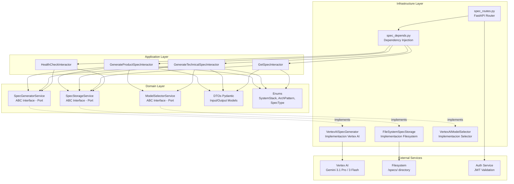
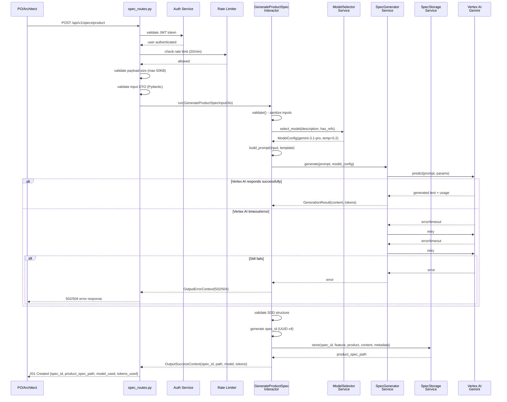
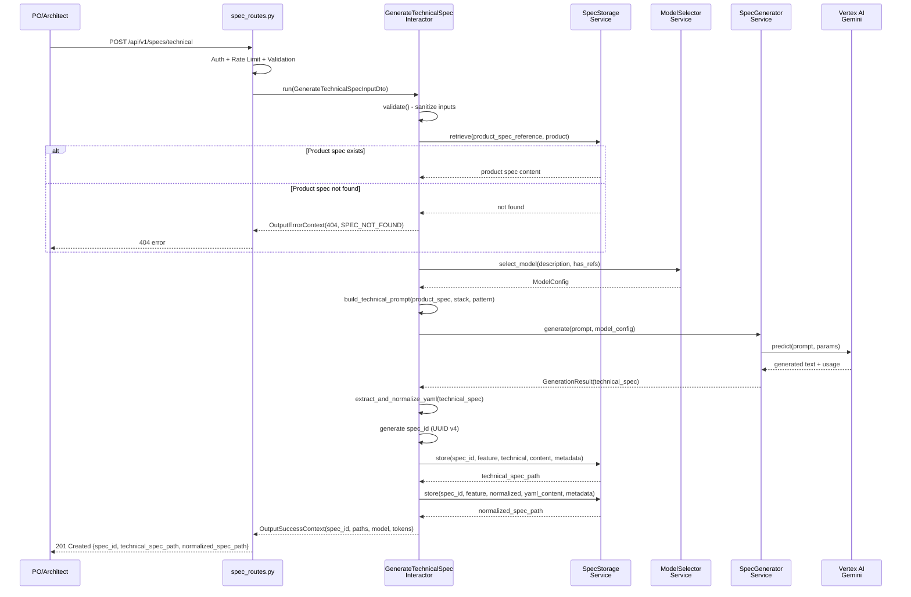
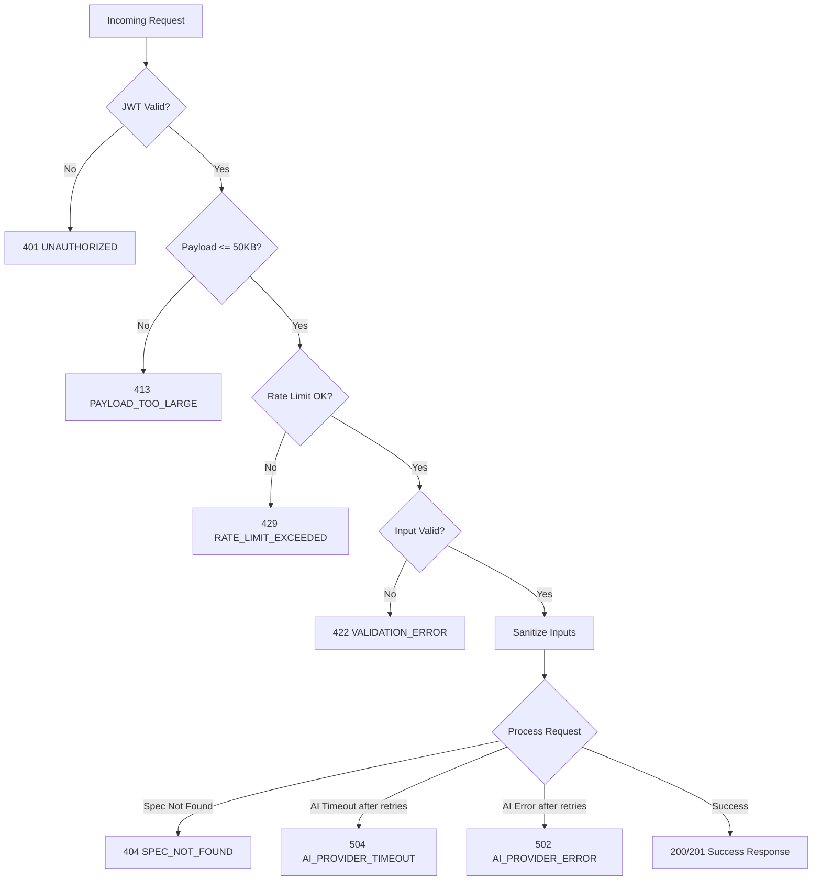

# AI Spec Discovery - Technical Solution Proposal

**Date**: 2026-03-19
**Author**: Architecture Team
**Status**: Draft

---

## 1. Solution Overview

### Problem Statement

Los Product Owners y Arquitectos de software necesitan generar especificaciones de producto (feature.yaml) y especificaciones tecnicas (technical.yaml) de forma manual, lo cual es un proceso lento, propenso a inconsistencias de formato y que requiere conocimiento profundo del estandar SDD del equipo. Se requiere un servicio que automatice esta generacion mediante modelos de IA, seleccionando automaticamente el modelo optimo segun la complejidad de la funcionalidad.

### Proposed Solution

Implementar un modulo dentro del backend FastAPI existente (`src/modules/spec_discovery/`) que exponga 4 endpoints REST para la generacion y consulta de especificaciones. El modulo sigue la Clean Architecture de 3 capas (Domain, Application, Infrastructure) establecida en el proyecto, utilizando Vertex AI (Gemini 3.1 Pro / Gemini 3 Flash) como proveedor de IA y filesystem para almacenamiento de especificaciones.

La solucion abstrae todas las dependencias de infraestructura detras de interfaces ABC en el domain layer (SpecGeneratorService, SpecStorageService, ModelSelectorService), permitiendo testabilidad y flexibilidad para cambiar proveedores en el futuro.

### Scope

**In scope**:
- Generacion automatica de especificaciones de producto (product spec) via Vertex AI
- Generacion automatica de especificaciones tecnicas (technical spec + normalized YAML) via Vertex AI
- Consulta de especificaciones almacenadas por spec_id
- Health check del servicio y sus dependencias (Vertex AI, storage)
- Seleccion automatica de modelo AI segun complejidad (descripcion > 500 chars)
- Sanitizacion de entradas contra prompt injection
- Rate limiting (20 req/min por usuario)
- Autenticacion JWT en todos los endpoints excepto health

**Out of scope**:
- Interfaz de usuario (frontend/mobile) para interactuar con el servicio
- Edicion manual de especificaciones generadas via API
- Versionado de especificaciones (v1, v2, etc.)
- Generacion batch de multiples especificaciones en una sola solicitud
- Integracion directa con agentes de desarrollo (los agentes consumen los YAML generados por archivo)
- Base de datos relacional para metadata (se usa filesystem + JSON)

---

## 2. Component Architecture

### Component Diagram



### Components Description

| Component | Responsibility | Layer | Dependencies |
|-----------|---------------|-------|--------------|
| `spec_routes.py` | Expone endpoints HTTP, valida JWT, aplica rate limiting, delega a interactors | Infrastructure | Auth Service, Rate Limiter, Interactors (via depends) |
| `spec_depends.py` | Instancia implementaciones concretas e inyecta en interactors | Infrastructure | Todas las implementaciones concretas |
| `GenerateProductSpecInteractor` | Orquesta generacion de product spec: selecciona modelo, construye prompt, genera spec, almacena resultado | Application | SpecGeneratorService, SpecStorageService, ModelSelectorService |
| `GenerateTechnicalSpecInteractor` | Orquesta generacion de technical spec: lee product spec base, selecciona modelo, genera spec tecnica + YAML normalizado, almacena | Application | SpecGeneratorService, SpecStorageService, ModelSelectorService |
| `GetSpecInteractor` | Recupera especificacion almacenada por spec_id y tipo | Application | SpecStorageService |
| `HealthCheckInteractor` | Verifica conectividad con Vertex AI y disponibilidad de storage | Application | SpecGeneratorService, SpecStorageService |
| `SpecGeneratorService` | Interfaz ABC para abstraccion del proveedor de IA - define metodo `generate(prompt, model_config)` | Domain | Ninguna (interfaz pura) |
| `SpecStorageService` | Interfaz ABC para abstraccion de almacenamiento - define metodos `store()`, `retrieve()`, `exists()` | Domain | Ninguna (interfaz pura) |
| `ModelSelectorService` | Interfaz ABC para seleccion de modelo - define metodo `select_model(description, has_refs)` | Domain | Ninguna (interfaz pura) |
| `VertexAISpecGenerator` | Implementacion concreta de SpecGeneratorService usando SDK de Vertex AI | Infrastructure | google-cloud-aiplatform SDK |
| `FileSystemSpecStorage` | Implementacion concreta de SpecStorageService usando pathlib/os | Infrastructure | Filesystem /specs/ |
| `VertexAIModelSelector` | Implementacion concreta de ModelSelectorService con logica de seleccion basada en longitud de descripcion | Infrastructure | Configuracion de modelos |
| DTOs | Modelos Pydantic para validacion de request/response | Domain | Pydantic v2 |
| Enums | Enumeraciones para system_stack, architecture_pattern, spec_type | Domain | Ninguna |

### Interface Definitions

**SpecGeneratorService (Port - Domain Layer)**
- `generate(prompt: str, model_config: ModelConfig) -> GenerationResult`: Envia prompt al modelo de IA y retorna la especificacion generada con metadatos (tokens, modelo usado)
- `health_check() -> bool`: Verifica conectividad con el proveedor de IA

**SpecStorageService (Port - Domain Layer)**
- `store(spec_id: str, feature_name: str, spec_type: SpecType, content: str, metadata: dict) -> str`: Almacena especificacion y retorna ruta
- `retrieve(spec_id: str, spec_type: SpecType) -> SpecContent`: Recupera contenido y metadatos de una especificacion
- `exists(spec_id: str) -> bool`: Verifica si una especificacion existe
- `health_check() -> bool`: Verifica disponibilidad del almacenamiento

**ModelSelectorService (Port - Domain Layer)**
- `select_model(description: str, has_previous_refs: bool) -> ModelConfig`: Selecciona modelo y configuracion segun reglas de negocio (longitud de descripcion, referencias previas)

---

## 3. Flow Diagrams

### Main Flow: Product Spec Generation



### Technical Spec Generation Flow



### Error Handling Flow



---

## 4. Solution Options Analysis

### Option 1: Modulo integrado en backend existente con interfaces ABC (Recomendado)

**Description**

Implementar `ai_spec_discovery` como un modulo dentro del backend FastAPI existente en `src/modules/spec_discovery/`, siguiendo la Clean Architecture de 3 capas del proyecto. Las dependencias de infraestructura (Vertex AI, filesystem) se abstraen detras de interfaces ABC en el domain layer.

**Pros**
- Se reutiliza toda la infraestructura existente: auth JWT, deployment K8s, CI/CD, monitoring
- Sigue los patrones establecidos del proyecto (Clean Architecture, Ports & Adapters)
- Menor overhead operacional: no se necesita un nuevo servicio, deployment ni dominio DNS
- Testabilidad alta: todas las dependencias son inyectables via interfaces
- Time to market rapido: solo se implementa el modulo, no la infraestructura

**Cons**
- Acoplamiento de deployment: un despliegue del modulo implica desplegar todo el backend
- Si Vertex AI tiene latencia alta, podria impactar los health checks del servicio principal
- Escalado del modulo esta atado al escalado del backend completo

**Complexity**
- Implementation: Medium
- Maintenance: Low
- Learning curve: Low (patrones ya conocidos por el equipo)

**Impact on Current Architecture**
- Se agrega un nuevo modulo en `src/modules/spec_discovery/` sin modificar modulos existentes
- Se registra el router en el main.py del backend
- Se agregan nuevas variables de entorno para configuracion de Vertex AI (via Doppler)

**Technical Risks**
- Latencia de Vertex AI: mitigado con timeout de 10s y 2 retries con backoff
- Prompt injection: mitigado con sanitizacion de entradas y delimitadores de seguridad en prompts
- Costos de API de Vertex AI: mitigado con seleccion automatica de modelo segun complejidad

### Option 2: Microservicio independiente

**Description**

Crear un microservicio FastAPI dedicado `spec-discovery-api` con su propio deployment, dominio DNS y pipeline CI/CD.

**Pros**
- Escalado independiente del backend principal
- Aislamiento total de fallos (caida de Vertex AI no afecta otros servicios)
- Deployment independiente sin riesgo al backend principal

**Cons**
- Overhead significativo de infraestructura: nuevo servicio K8s, ArgoCD app, dominio DNS, Doppler project
- Duplicacion de concerns cross-cutting: auth, logging, error handling, health checks
- Mayor tiempo de desarrollo (estimado 40-60% mas)
- Complejidad operacional adicional: otro servicio para monitorear, mantener y actualizar
- No justificado para el volumen esperado de solicitudes

**Complexity**
- Implementation: High
- Maintenance: Medium-High
- Learning curve: Low

### Option 3: Cloud Function / Cloud Run (Serverless)

**Description**

Implementar la generacion de specs como una Cloud Function (GCP) o servicio Cloud Run, fuera del cluster de Kubernetes.

**Pros**
- Escalado automatico a cero cuando no hay solicitudes
- Pago por uso (eficiente en costos para bajo volumen)
- Sin necesidad de mantener pods en K8s

**Cons**
- Rompe el modelo de orquestacion establecido (K8s + ArgoCD)
- Cold start puede exceder el timeout de 10s en las primeras solicitudes
- No se reutiliza la autenticacion JWT ni el middleware del backend
- Diferente modelo de deployment y monitoring (fuera del stack estandar)
- Mayor acoplamiento con GCP (vendor lock-in)

**Complexity**
- Implementation: Medium
- Maintenance: Medium (diferente modelo operativo)
- Learning curve: Medium (nuevo paradigma para el equipo)

### Decision Matrix

| Criteria | Weight | Option 1: Modulo integrado | Option 2: Microservicio | Option 3: Serverless |
|----------|--------|---------------------------|------------------------|---------------------|
| Implementation Complexity | 20% | 9/10 | 5/10 | 6/10 |
| Maintenance Cost | 25% | 9/10 | 5/10 | 6/10 |
| Scalability | 15% | 6/10 | 9/10 | 9/10 |
| Alignment with Current Arch | 20% | 10/10 | 7/10 | 3/10 |
| Time to Market | 10% | 9/10 | 4/10 | 6/10 |
| Team Familiarity | 10% | 10/10 | 8/10 | 4/10 |
| **Weighted Score** | | **8.75** | **5.95** | **5.65** |

---

## 5. Recommended Solution

### Selected Option: Option 1 - Modulo integrado en backend existente

### Justification

1. **Alineacion con la arquitectura establecida**: El proyecto ya sigue Clean Architecture de 3 capas con FastAPI. Agregar un modulo en `src/modules/spec_discovery/` es la extension natural que no introduce complejidad nueva.

2. **Reutilizacion de infraestructura**: Se aprovechan autenticacion JWT, deployment K8s, ArgoCD, Doppler, monitoring con Prometheus, y nginx-ingress existentes sin configuracion adicional.

3. **Time to market optimo**: No se necesita crear nueva infraestructura, nuevo servicio ni nuevo pipeline CI/CD. El esfuerzo se concentra 100% en la logica de negocio.

4. **Principio de Simplicity First**: Para el volumen esperado de solicitudes (herramienta interna para POs y arquitectos), un modulo dentro del backend existente es la solucion mas simple que resuelve el problema.

5. **Flexibilidad via interfaces**: Al usar interfaces ABC (SpecGeneratorService, SpecStorageService, ModelSelectorService), si en el futuro se necesita migrar a otro proveedor de IA o cambiar el almacenamiento, solo se reemplaza la implementacion sin afectar la logica de negocio.

### Trade-offs Accepted

- **Acoplamiento de deployment**: Aceptable porque el backend tiene deployment automatizado y los releases son frecuentes.
- **Escalado atado**: Aceptable porque el volumen esperado de solicitudes de spec discovery es bajo comparado con el trafico del backend principal.
- **Impacto de latencia AI**: Mitigado con timeouts, retries, y el health check de specs que reporta el estado de Vertex AI sin afectar el health check principal del backend.

---

## 6. Technical Decisions

### Decision 1: Filesystem vs Base de Datos para almacenamiento de specs

- **Options considered**: PostgreSQL (tabla specs), Filesystem (/specs/), Cloud Storage (GCS)
- **Selected**: Filesystem
- **Justification**: Las especificaciones son documentos de texto (markdown, YAML) que se leen y escriben completos, sin necesidad de queries parciales ni relaciones. El filesystem es la solucion mas simple, evita migraciones de BD, y los archivos generados pueden ser consumidos directamente por los agentes de desarrollo sin necesidad de extraerlos de una BD. Para un volumen bajo de documentos (herramienta interna), el filesystem es suficiente.

### Decision 2: Tres interfaces ABC (SpecGenerator, SpecStorage, ModelSelector) vs una sola interfaz

- **Options considered**: Una interfaz monolitica SpecService, tres interfaces segregadas
- **Selected**: Tres interfaces segregadas
- **Justification**: Sigue el Interface Segregation Principle (SOLID). Cada interfaz tiene una responsabilidad clara. Permite mockear cada dependencia de forma independiente en tests. Permite reemplazar implementaciones individualmente (ej. cambiar de filesystem a S3 sin tocar el generador de IA).

### Decision 3: Rate limiting a nivel de aplicacion vs API Gateway

- **Options considered**: slowapi en FastAPI, rate limiting en nginx-ingress, custom middleware
- **Selected**: slowapi en FastAPI (o custom middleware con Redis)
- **Justification**: El rate limiting es especifico por usuario (20 req/min por usuario JWT), lo cual requiere identificar al usuario. Esto es mas facil de implementar a nivel de aplicacion donde ya se tiene el token JWT decodificado. El nginx-ingress no tiene acceso directo al user_id del JWT.

### Decision 4: Prompts embebidos en codigo vs almacenados externamente

- **Options considered**: Templates en archivos .txt/.md en /templates/, constantes en codigo Python, configuracion en Doppler
- **Selected**: Templates en archivos .txt/.md dentro del modulo
- **Justification**: Los templates de prompts son parte de la logica del modulo y deben versionarse junto con el codigo. Archivos separados permiten editar prompts sin modificar codigo Python. No es necesario externalizar a Doppler porque no son secretos ni configuracion de entorno.

---

## 7. Module Structure

```
src/modules/spec_discovery/
    domain/
        spec_generator_service.py          # ABC interface (Port)
        spec_storage_service.py            # ABC interface (Port)
        model_selector_service.py          # ABC interface (Port)
        generate_product_spec_dto.py       # Input/Output DTOs
        generate_technical_spec_dto.py     # Input/Output DTOs
        get_spec_dto.py                    # Input/Output DTOs
        health_check_dto.py                # Output DTO
        spec_enums.py                      # SystemStack, ArchPattern, SpecType enums
    application/
        generate_product_spec_interactor.py
        generate_technical_spec_interactor.py
        get_spec_interactor.py
        health_check_interactor.py
    infrastructure/
        routes/v1/
            spec_routes.py                 # FastAPI router con 4 endpoints
        vertex_ai_spec_generator.py        # Implementacion SpecGeneratorService
        filesystem_spec_storage.py         # Implementacion SpecStorageService
        vertex_ai_model_selector.py        # Implementacion ModelSelectorService
        spec_depends.py                    # Dependency injection factories
        prompt_sanitizer.py                # Sanitizacion de inputs contra prompt injection
        templates/
            product_spec_prompt.md         # Template de prompt para product specs
            technical_spec_prompt.md       # Template de prompt para technical specs
```

---

## 8. Implementation Phases

| Phase | Description | Duration (Probable) | Dependencies |
|-------|-------------|---------------------|--------------|
| Phase 1: Foundation | Domain layer (interfaces, DTOs, enums) + estructura de modulo | 2 dias | Ninguna |
| Phase 2: Infrastructure Services | Implementaciones de SpecGeneratorService (Vertex AI), SpecStorageService (filesystem), ModelSelectorService | 3 dias | Phase 1 + Vertex AI API habilitada en GCP |
| Phase 3: Application Logic | Interactors para generacion de product spec, technical spec, get spec y health check | 3 dias | Phase 1 y Phase 2 |
| Phase 4: API Layer | Routes FastAPI, rate limiting, integracion con auth JWT, registro en main.py | 2 dias | Phase 3 |
| Phase 5: Prompt Engineering | Templates de prompts para product y technical specs, sanitizacion | 2 dias | Phase 2 |
| Phase 6: Testing | Unit tests (interactors), integration tests (Vertex AI mock, filesystem), tests de rate limiting y auth | 3 dias | Phase 4 y Phase 5 |
| Phase 7: DevOps & Deployment | Workload Identity GCP, variables Doppler, manifests K8s, ArgoCD | 2 dias | Phase 4 + Infra GCP configurada |

**Total Duration**:
- Optimistic: 12 dias (2.5 semanas)
- Probable: 17 dias (3.5 semanas)
- Pessimistic: 23 dias (4.5 semanas)

**Confidence Level**: Medium (+/- 25%) - La mayor incertidumbre esta en el prompt engineering (iteraciones de calidad de salida) y la configuracion de Workload Identity para Vertex AI.

---

## 9. Risks & Mitigations

| Risk | Probability | Impact | Mitigation |
|------|-------------|--------|------------|
| Latencia de Vertex AI supera 10s en p95 | Medium | High | Timeout de 10s + 2 retries con backoff. Alerta automatica cuando p95 > 10s. Evaluar modelos mas rapidos si persiste |
| Calidad de especificaciones generadas insuficiente | Medium | High | Iteraciones de prompt engineering. Validacion de estructura SDD post-generacion. Feedback loop con usuarios |
| Prompt injection por parte de usuarios | Low | High | Sanitizacion de entradas. Delimitadores de seguridad en prompts. Inputs acotados por DTOs Pydantic con validacion |
| Costos inesperados de Vertex AI | Low | Medium | Seleccion automatica de modelo barato para features simples. Rate limiting de 20 req/min. Monitoreo de tokens consumidos |
| Workload Identity mal configurado impide acceso a Vertex AI | Medium | High | Validar configuracion en staging antes de produccion. Health check endpoint verifica conectividad |
| Cambio de API de Vertex AI / Gemini | Low | Medium | Dependencia abstraida detras de SpecGeneratorService. Solo la implementacion concreta necesita actualizarse |

---

## 10. Quality Assurance Strategy

### Testing Strategy

| Type | Coverage Target | Scope |
|------|----------------|-------|
| Unit Tests | > 90% | Interactors con mocks de SpecGeneratorService, SpecStorageService, ModelSelectorService |
| Integration Tests | > 80% | FileSystemSpecStorage contra filesystem temporal, rate limiter con Redis test |
| Contract Tests | 100% endpoints | Validar request/response schemas de los 4 endpoints |
| Load Tests | p95 < 10s | 100 solicitudes concurrentes contra endpoint de generacion |

### Monitoring & Alerts

| Metric | Threshold | Action |
|--------|-----------|--------|
| Latencia p95 de generacion | > 10 segundos | Alerta a equipo de desarrollo |
| Tasa de errores 5xx | > 5% en ventana de 5 min | Alerta critica |
| Tokens consumidos diarios | > umbral definido | Notificacion de costos |
| Rate limit hits | > 50/hora | Review de uso abusivo |

---

**End of Technical Proposal**